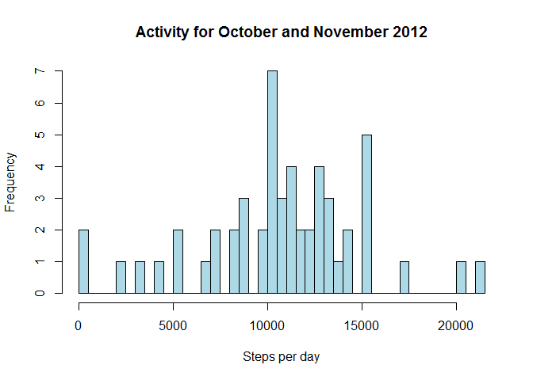
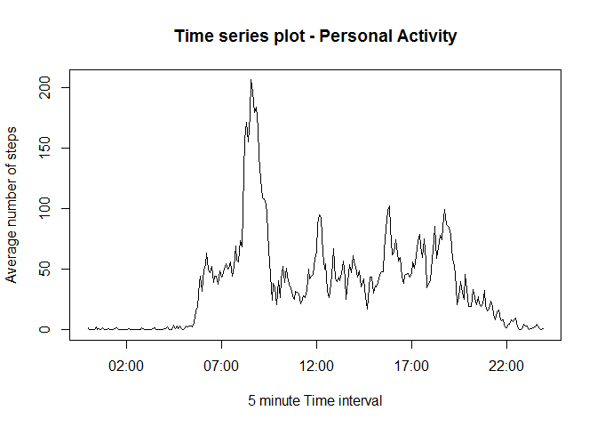
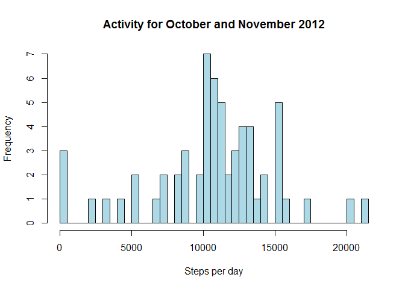

# Reproducible Research - Assignment1
Peter Vennel  
Sunday, March 08, 2015  


## Loading and preprocessing the data

1. Load the data

```r
library(plyr)
library(ggplot2)

## initialize file name variables so that yu just refer to it everytime you need it.
zipFile <- "activity.zip"
dataFile <- "activity.csv"

## unzip the file to get csv file.
unzip(zipFile, dataFile)
```


2. Process/transform the data (if necessary) into a format suitable for your analysis

```r
## create a Data Table from the csv file
activityDT <- read.table(dataFile, sep=",", header=T)
```


## What is mean total number of steps taken per day?
1. Calculate the total number of steps taken per day

```r
## remove NAs
activityDTNonNA <- subset(activityDT, activityDT$step != "NA")

## use ddply to summarize by day
activityDailySummary <- ddply(activityDTNonNA, .(date), summarize, dailySteps=sum(steps))
```

2. Make a histogram of the total number of steps taken each day

```r
hist(activityDailySummary$dailySteps, col="lightblue", breaks=53, 
           main="Activity for October and November 2012" ,
           xlab="Steps per day")
```

 

3. Calculate and report the mean and median of the total number of steps taken per day

```r
## median of the total number of steps per day
median(activityDailySummary$dailySteps)
```

```
## [1] 10765
```

```r
## mean of the total number of steps per day
mean(activityDailySummary$dailySteps)
```

```
## [1] 10766.19
```


## What is the average daily activity pattern?

1. Make a time series plot (i.e. type = "l") of the 5-minute interval (x-axis) and the average number of steps taken, averaged across all days (y-axis)

```r
## group by intervals and calculate the Average
activity5MinSummary <- ddply(activityDTNonNA, .(interval), summarize, 
                             Avg5Mins=sum(steps)/length(steps) )

## This is to handle the gaps as we move from 55 minutes to the hour every hour. 
## other wise it will be treated as integer with gap of 45 instead of 5.
activity5MinSummary$newInterval <- strptime(sprintf("%04d", 
                                            as.numeric(activity5MinSummary$interval)), 
                                            format="%H%M")
```


```r
plot(x=activity5MinSummary$newInterval, 
     y=activity5MinSummary$Avg5Mins,
     type="l",
     main="Time series plot - Personal Activity",
     xlab="5 minute Time interval",
     ylab="Average number of steps")
```

 


2. Which 5-minute interval, on average across all the days in the dataset, contains the maximum number of steps?

```r
# calculate the max 5 minute Interval
Max5MinInterval <- activity5MinSummary[which.max(activity5MinSummary$Avg5Mins), ]

Max5MinIntervalSlot <- strftime(Max5MinInterval$newInterval, format= "%H:%M")
```

The max number of steps is **206.1698113** and it occurred during **08:35**


## Inputing missing values

1. Calculate and report the total number of missing values in the dataset (i.e. the total number of rows with NAs)


```r
## Number of rows with missing values
sum(is.na(activityDT$steps))
```

```
## [1] 2304
```


2. Devise a strategy for filling in all of the missing values in the dataset. The strategy does not need to be sophisticated. For example, you could use the mean/median for that day, or the mean for that 5-minute interval, etc.

> My approach is to populate NA with mean for that  day/288. I am dividing by 288, as there are 288 '5 Minutes Interval'. But there are days for which we do not have any mean. What I am going to do is calculate the mean for all the days where the values are available and use that value for all the days where values are missing.

3. Create a new dataset that is equal to the original dataset but with the missing data filled in.


```r
## Need to add mean values for the following days
## 10/1, 10/8, 11/1, 11/4, 11/9, 11/10, 11/14, 11/30


missingDatesDF <- c('2012-10-01','2012-10-08','2012-11-01','2012-11-04',
                    '2012-11-09','2012-11-10','2012-11-14','2012-11-30')

## get the Mean Daily steps
meanSteps = round(mean(activityDailySummary$dailySteps))
missingValuesDF <- c(meanSteps, meanSteps, meanSteps, meanSteps,
                     meanSteps, meanSteps, meanSteps, meanSteps)

## create dataset with missing dates and values
missingValuesDF <- as.data.frame(cbind(missingDatesDF, missingValuesDF))

## assign the same column names to this data set before appending it to teh main dataset
names(missingValuesDF) <- names(activityDailySummary)

## append to main dataset.
activityDailySummaryNew <- rbind(activityDailySummary, missingValuesDF)

## copy the original Data set into a new one
activityDTNew <- activityDT
## populate only the missing values with the mean for that day divided by 288.
## as there are 288 5 minnute interval in a day.
suppressWarnings(activityDTNew$steps[is.na(activityDTNew$steps)] <- 
  round(as.numeric(activityDailySummaryNew[match(activityDTNew$date,
                                                 activityDailySummaryNew$date), 2])/288))
```


4. Make a histogram of the total number of steps taken each day and Calculate and report the mean and median total number of steps taken per day. Do these values differ from the estimates from the first part of the assignment? What is the impact of imputing missing data on the estimates of the total daily number of steps?


```r
## use ddply to summarize by day
activityDailySummaryNew <- ddply(activityDTNew, .(date), summarize, dailySteps=sum(steps))

hist(activityDailySummaryNew$dailySteps, col="lightblue", breaks=61, 
     main="Activity for October and November 2012" ,
     xlab="Steps per day")
```

 

```r
## Calculating the Daily Median steps
median(activityDailySummaryNew$dailySteps)
```

```
## [1] 10944
```

```r
## Calculating the Daily Mean steps
mean(activityDailySummaryNew$dailySteps)
```

```
## [1] 10737.57
```


## Are there differences in activity patterns between weekdays and weekends?


```r
## wday gives numeric weekday (0-Sunday ... 6-Saturday)
## so now we have new column with numeric values representing the day of the week
activityDTNew$dayOfWeek <-as.POSIXlt(as.Date(activityDTNew$date))$wday

## creating a new field to store weekday/weekend flag
## initially set everything to weekday
activityDTNew$weekday <- "Weekday"
## overwrite the rows which is weekend with "weekend"
activityDTNew$weekday[activityDTNew$dayOfWeek == 0 | activityDTNew$dayOfWeek== 6] <- "Weekend"

## grouping weekday data by intervals
activityDTNewSummary <- ddply(activityDTNew, c("interval","weekday"), summarize, 
                          Avg5Mins=sum(steps)/length(steps))
```

Code to generate the plot


```r
ggplot(data=activityDTNewSummary, aes(x=interval, y=Avg5Mins)) +
  geom_line() + 
  facet_wrap(~weekday, nrow=2)+
  ylab("Average number of steps") +
  xlab("5 minute Time interval") +
  ggtitle("Comparison of Activity between Weekdays and Weekends")
```

 

